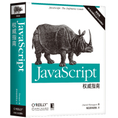
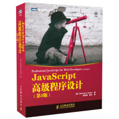
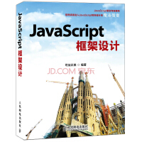
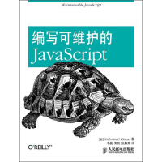
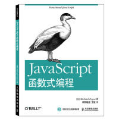

> - [技术博客](https://github.com/zhaoqize/blog)
> - [前端指南](https://github.com/zhaoqize/FE-Guide)
> - [一点感悟](https://github.com/zhaoqize/Life)

**如果觉得我的整理给您带来一点帮助,不妨 star✨,想要订阅请 watch👀.**

## 目录
* [前端书籍](#前端书籍)
* [文章](#文章)
* [前端团队](#前端团队)
* [前端社区](#前端社区)
* [前端视频网站](#前端视频网站)
* [代码仓库](#代码仓库)
* [在线编辑](#在线编辑)
* [模版引擎](#模版引擎)
* [前端框架](#前端框架)
* [前端UI框架](#前端UI框架)
* [移动端(混合)框架](#移动端框架)
* [移动UI框架](#移动UI框架)
* [状态管理库](#状态管理库)
* [Nodejs框架(服务)](#Nodejs框架/服务)
* [SSR(服务端渲染)](#SSR/服务端渲染)
* [桌面应用构建](#桌面应用构建)
* [预编译](#预编译)
* [构建工具](#构建工具)
* [前端包管理器](#前端包管理器)
* [前端测试](#前端测试)
* [常用工具](#常用工具)

## 前端书籍

## 文章
### 前端基础
- [ECMAScript 6 入门](http://es6.ruanyifeng.com/)
- [JS进阶 基本类型 引用类型 简单赋值 对象引用](https://segmentfault.com/a/1190000002789651)
- [前端文摘：深入解析浏览器的幕后工作原理 - 梦想天空（山边小溪） - 博客园](http://www.cnblogs.com/lhb25/p/how-browsers-work.html)
- [认识 V8 引擎 - 知乎专栏](https://zhuanlan.zhihu.com/p/27628685)
- [基于webpack2.x的vue2.x的多页面站点](http://www.cnblogs.com/zqzjs/p/6834843.html)
- [【移动适配】移动Web怎么做屏幕适配（一）](https://segmentfault.com/a/1190000004524243)
- [【移动适配】一个像素的border怎么实现](https://segmentfault.com/a/1190000004538413)
- [视区相关单位vw, vh..简介以及可实际应用场景](http://www.zhangxinxu.com/wordpress/2012/09/new-viewport-relative-units-vw-vh-vm-vmin/)
- [使用Flexible实现手淘H5页面的终端适配](https://github.com/amfe/article/issues/17)
- [JavaScript下的setTimeout(fn,0)意味着什么？](http://www.cnblogs.com/silin6/archive/2015/03/12/4333999.html)
- [JavaScript队列函数和异步执行](http://caibaojian.com/javascript-queue-function.html)
- [JavaScript Event Loop机制详解与Vue.js中nextTick的实践应用](https://m.aliyun.com/yunqi/articles/204129?spm=5176.mtagdetail.0.0.fZx5vR)
- [HTML系列：macrotask和microtask](http://www.qingpingshan.com/m/view.php?aid=183193)
- [import、require、export、module.exports 混合使用详解](https://juejin.im/post/5a2e5f0851882575d42f5609)

### HTTP
- [你真的会使用XMLHttpRequest吗？](https://segmentfault.com/a/1190000004322487)

### 混合开发
- [为什么可以通过URL来调起APP - URL Scheme和Intent](http://www.cnblogs.com/zqzjs/p/7505265.html)
- [H5页面中尝试调起APP](http://www.cnblogs.com/zqzjs/p/7504236.html)
- [Weex的原生开发](http://www.cnblogs.com/zqzjs/p/7365726.html)
- [Android Studio集成到Genymotion模拟器](http://www.cnblogs.com/zqzjs/p/7411361.html)
- [VasSonic：手Q开源Hybrid框架介绍](http://www.infoq.com/cn/articles/vassonic-manual-q-open-source-hybrid-framework)
- [开发首屏广告(Android)简述](http://blog.csdn.net/caroline_wendy/article/details/50183487)
- [Hybrid APP架构设计思路](https://segmentfault.com/a/1190000004263182)

### 性能优化
- [内存管理](https://developer.mozilla.org/zh-CN/docs/Web/JavaScript/Memory_Management)
- [前端的长列表性能优化](http://fishedee.com/%E5%89%8D%E7%AB%AF/2017/02/27/%E5%89%8D%E7%AB%AF%E7%9A%84%E9%95%BF%E5%88%97%E8%A1%A8%E6%80%A7%E8%83%BD%E4%BC%98%E5%8C%96.html)
- [vue 性能优化](https://github.com/Coffcer/Blog/issues/3)

### 前端工程
- [如何管理一个前端基础架构团队- AdRoll - 众成翻译](https://juejin.im/entry/59c7d35bf265da065754df2f)
- [QCon北京2014《CardKit & DOMO UI - 移动时代技术与设计的十字路口》技术篇](https://www.douban.com/note/347692465/)
- [前端工程——基础篇](https://segmentfault.com/r/1250000011218832?shareId=1210000011218833)
- [对无线电商动态化方案的思考](https://github.com/amfe/article/issues/13)
- [大公司里怎样开发和部署前端代码？](https://www.zhihu.com/question/20790576)
- [美团点评境外度假团队前端项目开发实践总结](https://tech.meituan.com/fe-overseas-practice.html)

### AST
- [astexplorer](https://astexplorer.net/)
- [javascript-ast](http://resources.jointjs.com/demos/javascript-ast)
- [esprima](https://github.com/jquery/esprima)

### 业内发展
- [Kotlin](https://kotlinlang.org/)：Kotlin 可以编译成Java字节码，也可以编译成 JavaScript，方便在没有 JVM 的设备上运行
- [clojurescript](https://github.com/clojure/clojurescript)：基于Clojure语言的JS封装
- [PWA](https://developers.google.com/web/progressive-web-apps/)：PWA（Progressive Web App），渐进式网络应用
- [React Native](http://facebook.github.io/react-native/)：基于 React 的跨平台移动应用开发框架
- [Nodejs](https://nodejs.org/en/)：是一个基于 Chrome V8 引擎的 JavaScript 运行环境
- [小程序](https://developers.weixin.qq.com/miniprogram/dev/api/)

### 工具使用
- [Charles从入门到放弃](http://www.cnblogs.com/zqzjs/p/7763406.html)

### 其他
- [Jade模板引擎让你飞](http://www.cnblogs.com/zqzjs/p/6057254.html)

## 前端团队
Team | Team | Team
--- | --- | ---
[淘宝前端团队（FED）](http://taobaofed.org/) | [腾讯前端IMWEB团队](http://imweb.io/) | [腾讯ISUX](https://isux.tencent.com/)
[百度用户体验中心](http://ued.baidu.com/#/home) | [腾讯设计团队](http://mxd.tencent.com/) | [360奇舞团](https://weekly.75team.com/)
[百度前端研发部](http://fex.baidu.com/) | [美团点评技术团队](https://tech.meituan.com/)  | [腾讯Web前端团队](http://www.alloyteam.com)

## 前端社区
Community | Community | Community
--- | --- | ---
[博客园](http://www.csdn.net/) | [CSDN](http://www.csdn.net/) | [开源中国](https://oschina.net/)
[掘金](https://juejin.im/timeline) | [segmentfault](https://segmentfault.com/)  |  [前端网](http://www.qdfuns.com/)
[大前端](http://www.daqianduan.com) | [乱炖](http://www.html-js.com/) | [CNODE](https://cnodejs.org/)

## 前端视频网站
Learn | Learn | Learn
--- | --- | ---
[极客学院](http://www.jikexueyuan.com/) | [慕课网](http://www.imooc.com/) | [egghead](https://egghead.io/)

## 代码仓库
Repositorie | Repositorie | Repositorie
--- | --- | ---
[github](https://github.com/) | [bitbucket](https://bitbucket.org/) | [码云](https://gitee.com/)

## 在线编辑
CodeEdit | CodeEdit
--- | ---
[CodePen](https://codepen.io/) | [jsfiddle](https://jsfiddle.net/)

## 模版引擎
名称 | 简介
---|---
[Pug(Jade)](https://github.com/pugjs/pug) | Pug – robust, elegant, feature rich template engine for Node.js
[Handlebars](https://github.com/wycats/handlebars.js) | 前端模板引擎

## 前端框架
名称 | 简介
--- | ---
[React ](https://facebook.github.io/react/) | React is a JavaScript library for building user interfaces.
[Vue](https://vuejs.org/) | 尤大的MVVM框架
[Angular](http://angularjs.org/) | Google推出的MVVM框架

## 前端UI框架

名称 | 简介
---|---
[Bootstrap](http://getbootstrap.com/) | 经典
[Bootstrap-Material-Design](https://github.com/FezVrasta/bootstrap-material-design) | material-design设计风格的Bootstrap
[Material-UI](http://www.material-ui.com/#/components/) | React版本Material-UI
[Ant Design of React](https://ant.design/index-cn) | React版本的Ant Design
[Element-UI](https://github.com/ElemeFE/element) | 基于vue的UI框架
[IView](https://github.com/iview/iview) | A high quality UI Toolkit built on Vue.js 2.0

## 移动端(混合)框架
库 | 简介
--- | ---
[React-Native](https://github.com/facebook/react-native) | A framework for building native apps with React.
[Ionic](https://github.com/ionic-team/ionic) | Build amazing native and progressive web apps with open web technologies
[Weex](https://github.com/alibaba/weex) | A framework for building Mobile cross-platform UI

## 移动UI框架
库 | 简介
--- | ---
[Vux](https://github.com/airyland/vux) | Mobile UI Components based on Vue & WeUI 
[Weui](https://github.com/Tencent/weui) | A UI library by WeChat official design team
[Amazeui](https://github.com/amazeui/amazeui) | Amaze UI, a mobile-first and modular front-end framework
[MUI](https://github.com/dcloudio/mui) | 最接近原生APP体验的高性能框架
[Mint-UI](https://github.com/ElemeFE/mint-ui) | Mobile UI elements for Vue.js
[SUI-Mobile](https://github.com/sdc-alibaba/SUI-Mobile) | 阿里巴巴国际UED前端出品的移动端UI库，轻量精美
[Muse-UI](https://github.com/museui/muse-ui) | Material Design UI library for Vuejs 2.0
[Ant-Design-Mobile](https://github.com/ant-design/ant-design-mobile) | A configurable Mobile UI

## 状态管理库
库 | 简介
--- | ---
[Redux](https://github.com/reactjs/redux) | Predictable state container for JavaScript apps
[Flux](https://github.com/facebook/flux) | An application architecture for React utilizing a unidirectional data flow.
[Vuex](https://vuex.vuejs.org/) | Centralized State Management for Vue.js
[Mobx](https://github.com/mobxjs/mobx) | Simple, scalable state management

## Nodejs框架(服务)
库 | 简介
--- | ---
[Express](https://github.com/expressjs/express) | Fast, unopinionated, minimalist web framework for node
[Koa](https://github.com/koajs/koa) | Expressive middleware for node.js using ES2017 async functions
[Fastify](https://github.com/fastify/fastify) | Fast and low overhead web framework, for Node.js
[Socket-IO](https://github.com/socketio/socket.io) | Realtime application framework (Node.JS server)
[PM2](https://github.com/Unitech/pm2) | Production Process Manager for Node.js apps with a built-in Load Balancer.
[Axios](https://github.com/axios/axios) | Promise based HTTP client for the browser and node.js
[Bluebird](https://github.com/petkaantonov/bluebird) | 🐦 ⚡️ Bluebird is a full featured promise library with unmatched performance

## SSR(服务端渲染)
库 | 简介
--- | ---
[Next.js](https://github.com/zeit/next.js) | Framework for server-rendered or statically-exported React apps
[Nuxt.js](https://github.com/nuxt/nuxt.js) | Versatile Vue.js Framework 

## 桌面应用构建
库 | 简介
--- | ---
[Electron](https://github.com/electron/electron) | Build cross platform desktop apps with JavaScript, HTML, and CSS
[NW.js](https://github.com/nwjs/nw.js) | https://nwjs.io
[Electron-Vue](https://github.com/SimulatedGREG/electron-vue) | 是用vue和Electron写桌面应用

## 预编译
库 | 简介
--- | ---
[Less](https://github.com/less/less.js) | The dynamic stylesheet language.
[Sass](https://sass-lang.com) | 
[TypeScript](https://github.com/Microsoft/TypeScript) | TypeScript is a superset of JavaScript that compiles to clean JavaScript output

## 构建工具
库 | 简介
--- | ---
[Gurnt](https://github.com/gruntjs/grunt) | Grunt: The JavaScript Task Runner
[Gulp](https://github.com/gulpjs/gulp) | The streaming build system
[Fis3](https://github.com/fex-team/fis3) | FIS3 面向前端的工程构建系统
[Webpack](https://github.com/webpack/webpack) | webpack is a module bundler
[Rollup](https://github.com/rollup/rollup) | Next-generation ES module bundler https://rollupjs.org

## 前端包管理器
库 | 简介
--- | ---
[Npm](https://github.com/npm/npm) |  a JavaScript package manager
[Yarn](https://github.com/yarnpkg/yarn) | 📦🐈 Fast, reliable, and secure dependency management.

## 前端测试
库 | 简介
--- | ---
[Puppeteer](https://github.com/GoogleChrome/puppeteer) | Headless Chrome Node API 
[Jest](https://github.com/facebook/jest) | Delightful JavaScript Testing.
[Mocha](https://github.com/mochajs/mocha) | ☕️ simple, flexible, fun javascript test framework for node.js & the browser
[Chai](https://github.com/chaijs/chai) | testing framework for node.js
[Rewire](https://github.com/jhnns/rewire) | Easy monkey-patching for node.js unit tests
[Istanbul](https://github.com/gotwarlost/istanbul) | JS code coverage tool

## 持续集成
库 | 简介
--- | ---
[Travis CI](https://github.com/travis-ci/travis-ci) | Free continuous integration platform for GitHub projects.

## 常用工具
名称 | 简介
--- | ---
[Can I use](http://caniuse.com/) | Can I use
[Charles](https://www.charlesproxy.com/) | 抓包，代理小能手
[tinypng](https://tinypng.com/) | 图片压缩
[favicon](http://www.favicon.cc/) | 生成站标
[easyicon](http://www.easyicon.net/) |  图标下载
[gopng](http://alloyteam.github.io/gopng/) | 图片生成
[图片转Base64](http://www.pjhome.net/web/html5/encodeDataUrl.htm) | 图片转Base64
[Beyond Compare 4](http://scootersoftware.com/) |  文件比对
[FastStone Capture](http://faststone.org/FSCaptureDetail.htm) | 截图，录屏
[Mark Main](http://www.getmarkman.com/) | 高效的设计稿标注、测量工具
[easy-mock](https://easy-mock.com) | Mock数据
[JSDoc](http://www.css88.com/doc/jsdoc/index.html) | JS生成文档
[regexr](http://www.regexr.com/) | 正则匹配
[pxtoem](http://pxl2rem.com/px-to-em) | px转em
[Unicode字符百科](https://unicode-table.com/cn/#control-character) | 查询各种unicode字符

